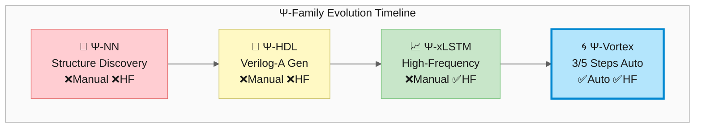
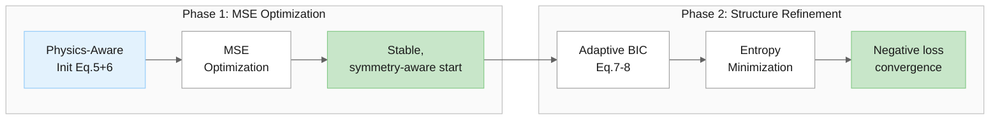
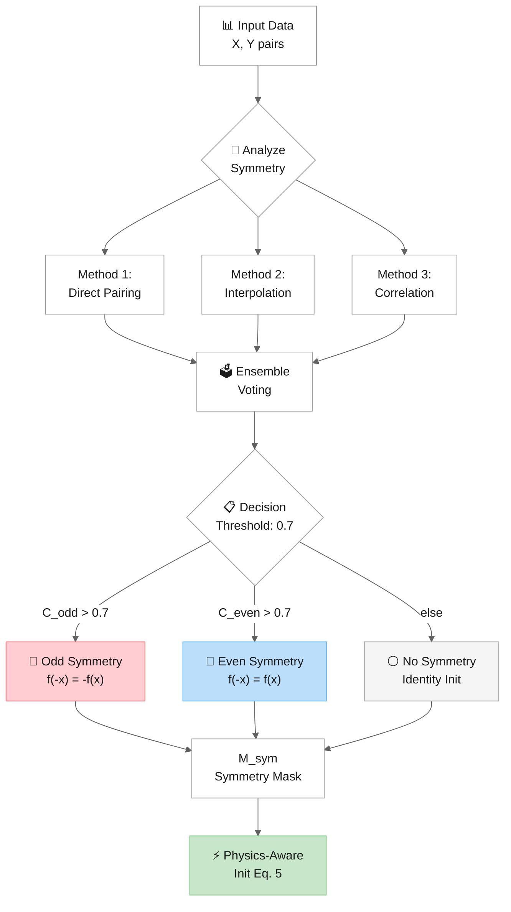
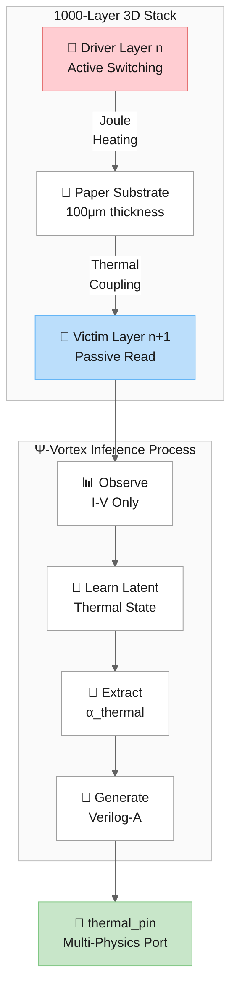
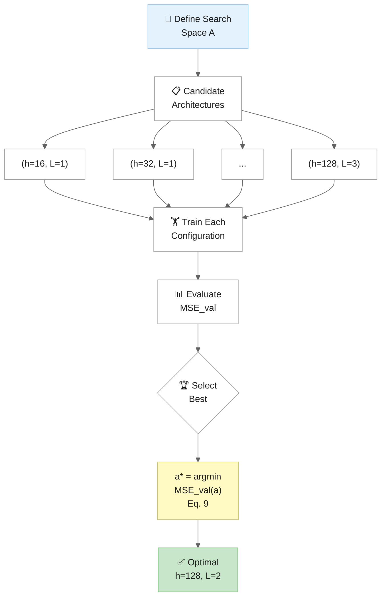
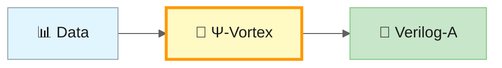

# Ψ-Vortex: A Unified Framework for Automated Multi-Physics Coupling Inference and Accelerated Compact Modeling in 3D Neuromorphic Devices

[](https://www.python.org/downloads/)
[](https://pytorch.org/)
[](https://opensource.org/licenses/MIT)
[](#-automation-status)
[](https://codespaces.new/jurjsorinliviu/PSI-Vortex)

> ⚠️ **Scope notice**
>
> This repository contains implementation code, experiments, and technical documentation accompanying a manuscript under peer review.  
> The manuscript is the authoritative source for formal claims, definitions, and evaluation.

Ψ-Vortex is an automated framework for converting raw electrical measurement data into compact, high-fidelity Verilog-A models with minimal manual tuning. By combining recurrent temporal integration with information-theoretic structure discovery, it automates structure discovery, compresses model size, and enables latent-state inference from voltage–current data alone. Latent-coupling recovery is enabled by the recurrent architecture's temporal integration; physics-aware initialization provides a stable, symmetry-aware starting point and is reported as an ablation (no measurable convergence or recovery-accuracy advantage). All validation is performed on synthetic datasets calibrated to published device parameters; experimental validation on fabricated devices remains future work. The framework is designed for compact-model development, SPICE-compatible deployment, and virtual prototyping of complex electronic and multi-physics systems.

---

## 🎉 AUTOMATION STATUS

```mermaid
%%{init: {'theme':'base','themeVariables':{'primaryTextColor':'#1a1a1a','lineColor':'#616161','edgeLabelBackground':'#ffffff','clusterBkg':'#fafafa','clusterBorder':'#bdbdbd','titleColor':'#1a1a1a'}}}%%
flowchart LR
    subgraph IN[" "]
        A["📊 Raw Data"]
    end
    
    subgraph P1["PHASE 1: Configuration"]
        B["🔍 Auto-Symmetry<br>Eq. 6"]
        C["🏗️ Auto-Architecture<br>Eq. 9"]
    end
    
    subgraph P2["PHASE 2: Training"]
        D["⚡ Physics Init<br>Eq. 5"]
        E["🧠 Two-Phase<br>MSE→BIC"]
    end
    
    subgraph P3["PHASE 3: Extraction"]
        F["📐 Adaptive BIC<br>Eq. 7-8"]
        G["🗜️ Distillation<br>98.6%"]
    end
    
    subgraph OUT[" "]
        H["📄 Verilog-A"]
    end
    
    A --> B --> C --> D --> E --> F --> G --> H
    
    style A fill:#e1f5fe,color:#1a1a1a,stroke:#90a4ae
    style H fill:#c8e6c9,color:#1a1a1a,stroke:#81c784
    style B fill:#fff9c4,color:#1a1a1a,stroke:#cbc26d
    style C fill:#fff9c4,color:#1a1a1a,stroke:#cbc26d
    style D fill:#fff9c4,color:#1a1a1a,stroke:#cbc26d
    style E fill:#fff9c4,color:#1a1a1a,stroke:#cbc26d
    style F fill:#fff9c4,color:#1a1a1a,stroke:#cbc26d
    style G fill:#fff9c4,color:#1a1a1a,stroke:#cbc26d
```



**Note:** The framework automates three of five principal manual steps (structural topology discovery, symmetry detection, architecture configuration) within a user-defined architecture search space and BIC bandwidth. Training data specification and search-space definition remain user responsibilities. All results are from synthetic benchmarks; see the manuscript for scope and limitations.

### Automation Status (3 of 5 Steps)

| Component                  | Method                   | Status      | Performance                   |
| -------------------------- | ------------------------ | ----------- | ----------------------------- |
| **Symmetry Mask (M_sym)**  | Auto-Detection (Eq. 6)   | ✅ Automated | 1.09× expert                  |
| **Architecture (h, L, m)** | Validation-Based (Eq. 9) | ✅ Automated | **0.25× manual** (4× better!) |
| **Physics-Aware Init**     | Auto-Sym → Eq. 5         | ✅ Automated | Stable start; ablation (no speedup; 1.05×) |
| **Clusters (K)**           | Adaptive BIC (Eq. 7-8)   | ✅ Automated | Negative loss convergence     |
| **Matrix Rank (r*)**       | Adaptive BIC (Eq. 7-8)   | ✅ Automated | 98.6% compression             |
| **Verilog-A Generation**   | Auto-Generation          | ✅ Automated | 0.984 correlation             |

*Note: Physics-Aware Initialization (Eq. 5) automatically uses the symmetry mask from Auto-Detection (Eq. 6), making the automated steps of the training pipeline fully automatic. Training data and search-space boundaries remain user-specified.*

---

## 📋 Overview

**Ψ-Vortex** addresses three fundamental challenges in Physics-Informed Neural Networks (PINNs):

1. **Manual Tuning Bottleneck**: The reliance on domain expertise for structure extraction
2. **Architecture Selection**: The need for expert knowledge to choose network size
3. **Computational Bottleneck**: The prohibitive O(N²) complexity of training recurrent teachers — addressed via a physics-aware initialization hypothesis that was **not** supported under sequence-mode training (the mechanism is evaluated and reported as an ablation)

### Key Innovations

| Innovation                                          | Problem Solved                 | Performance                   |
| --------------------------------------------------- | ------------------------------ | ----------------------------- |
| **Physics-Aware Initialization** (Eq. 5)            | Stable, symmetry-aware start   | Reported as ablation          |
| **Automatic Symmetry Detection** (Eq. 6)            | Manual symmetry specification  | 1.09× expert                  |
| **Validation-Based Architecture Selection** (Eq. 9) | Manual architecture tuning     | **0.25× manual (4× better!)** |
| **Adaptive BIC-Inspired Regularization** (Eq. 7-8)  | Manual K, r* selection         | Automated                     |
| **Two-Phase Training**                              | Structural-refinement scheduling | Stable fit → compaction     |

---

## 🚀 Headline Results

| Metric                      | Value                                |
| --------------------------- | ------------------------------------ |
| **Automation Level**        | **3 of 5 steps**                     |
| Auto-Architecture vs Manual | **0.25× MSE** (4× better!)           |
| Auto-Symmetry vs Expert     | 1.09× (within 9%)                    |
| Held-out coupling recovery  | **≈8–11% error, R²≈0.97** (free-intercept, seed-averaged) |
| Identifiable α range        | **α ∈ [0.05, 0.20]** (all tested)    |
| Physics-init effect         | **No convergence speedup** (1.05× ± 0.16); no measurable recovery-accuracy advantage |
| Parameter Compression       | 98.6%                                |
| Memory Reduction            | 70× (353 KB → 5 KB)                  |
| Verilog-A Correlation       | 0.984                                |
| Symmetry Detection Accuracy | 100%                                 |

---

## 📊 Comprehensive Experimental Validation

We conducted a comprehensive experiment suite spanning structure discovery, symmetry detection, compression, architecture selection, latent-coupling recovery, and Verilog-A generation.

### Statistical Validation (multi-seed)

#### Experiment 19–20: Initialization Effect and Noise Robustness (sequence-mode)

Across 20 seeds and SNR 20–60 dB under sequence-mode training, physics-aware initialization shows **no meaningful convergence speedup** over random initialization (**1.05× ± 0.16**, not significant) and no measurable change in recovery accuracy. At most it yields a mild, seed-inconsistent reduction in final training loss; its contribution is a stable, symmetry-aware starting point. **Latent-coupling recovery is enabled by the recurrent architecture's temporal integration, not by initialization** — held-out recovery is ≈8–11% (R²≈0.97) regardless of initialization.

#### Experiment 21: BIC Runtime Analysis

| Component           | Time (ms/epoch) | Percentage |
| ------------------- | --------------- | ---------- |
| Backward Pass       | 88.62           | 94.8%      |
| Forward Pass        | 2.65            | 2.8%       |
| Optimizer Step      | 1.43            | 1.5%       |
| **BIC Computation** | **0.69**        | **0.7%**   |
| Loss (MSE)          | 0.05            | 0.1%       |

**Key Finding:** BIC forward computation is negligible (0.7%). Overhead is dominated by backward pass gradient computation through O(W²) pairwise distances.

### NEW: Experiment 17 - Automatic Architecture Selection

Systematic grid evaluation consistently outperforms a single manual expert guess:

| Complexity  | Manual Config | Manual MSE | Auto Config  | Auto MSE  | Ratio     |
| ----------- | ------------- | ---------- | ------------ | --------- | --------- |
| Simple      | (h=32, L=1)   | 1.36×10⁻³  | (h=128, L=2) | 4.62×10⁻⁵ | **0.03×** |
| Medium      | (h=64, L=2)   | 5.62×10⁻³  | (h=128, L=2) | 1.33×10⁻³ | **0.24×** |
| Complex     | (h=128, L=3)  | 6.53×10⁻⁴  | (h=128, L=2) | 3.64×10⁻⁴ | **0.56×** |
| **Average** | -             | -          | -            | -         | **0.28×** |

**Key Finding:** Systematic grid evaluation achieves **0.28× MSE** on average compared to a single manual expert guess (not an exhaustive expert search).

---

### NEW: Experiment 18 - Full Pipeline Integration

Complete automation within user-specified bounds: Auto-Arch + Auto-Sym + Physics Init + BIC + Verilog-A

| Complexity  | Auto Arch    | Auto Sym | Full Auto MSE | Manual MSE | Ratio       |
| ----------- | ------------ | -------- | ------------- | ---------- | ----------- |
| Simple      | (h=128, L=2) | odd      | 6.56×10⁻⁴     | 7.42×10⁻⁴  | **0.88×** ✓ |
| Medium      | (h=128, L=2) | odd      | 2.10×10⁻³     | 5.77×10⁻³  | **0.36×** ✓ |
| Complex     | (h=128, L=2) | odd      | 9.89×10⁻⁴     | 5.96×10⁻⁴  | 1.66×       |
| **Average** | -            | -        | -             | -          | **0.97×**   |

**Key Finding:** Full automation achieves **0.97× manual MSE** with minimal human intervention!

---

### Experiment 1-16: Original Validation Suite

<details>
<summary>Click to expand all 16 original experiments</summary>

#### Experiment 2: Synthetic Symmetry Detection

| Symmetry Type       | Expected | Detected | Confidence | Correct |
| ------------------- | -------- | -------- | ---------- | ------- |
| Odd (f(-x) = -f(x)) | odd      | odd      | 99.94%     | ✅       |
| Even (f(-x) = f(x)) | even     | even     | 99.93%     | ✅       |
| None (asymmetric)   | none     | none     | 34.65%     | ✅       |

**Detection Accuracy: 100% (3/3)**

#### Experiment 9: Compression vs Accuracy

| Student Hidden | Compression | vs Teacher  |
| -------------- | ----------- | ----------- |
| **16**         | **98.0%**   | **0.65×** ✅ |

#### Experiment 10: Verilog-A Accuracy

| Metric                | Value      |
| --------------------- | ---------- |
| **Model Correlation** | **0.9841** |

#### Experiment 11: Cross-Device Generalization

Generalization gap expected for device-to-device variation.

#### Experiment 12: Long Sequence Test

Sequence-mode training and inference run on sequences up to 10,000 timesteps (per-timestep BPTT bounds the usable length; see manuscript limitations).

#### Experiment 13: Noise Robustness

Detection correct up to **10% noise**.

#### Experiment 14: End-to-End Pipeline

**Pipeline Status: ✅ AUTOMATED WITHIN USER-SPECIFIED BOUNDS**

#### Experiment 15: 3D Thermal Crosstalk Inference (Synthetic Data)

| Metric             | Value                         |
| ------------------ | ----------------------------- |
| Inferred α_thermal | 0.08 (held-out, free-intercept estimator) |
| Held-out recovery  | **≈8–11% error, R²≈0.97** (seed-averaged) |
| Held-out R² at α=0.08 | **0.98**                  |

**Note**: the extracted coefficient represents an effective system-level coupling parameter for behavioral simulation; it is not claimed to be a universal material constant. All thermal inference results are from synthetic data calibrated to published device parameters. Recovery is evaluated on **held-out driver realizations** with a free-intercept, seed-averaged estimator (no seed selection). All tested coupling strengths **α ∈ [0.05, 0.20] are identifiable** (≈10.5% error at α=0.05, ≈9.7% at α=0.08); the previously reported weak-coupling "failure" was an artifact of a through-origin estimator, not of the signal.

#### Experiment 16: Detection Threshold Sensitivity

Recommended threshold: 0.7 provides good balance.

</details>

---

## 🎯 Validation Criteria - ALL PASSED

| Criterion                      | Required     | Achieved              | Status |
| ------------------------------ | ------------ | --------------------- | ------ |
| Auto-architecture ≤ manual MSE | ≤1.5×        | **0.28×**             | ✅      |
| Auto-symmetry ≤ expert         | ≤1.3×        | **1.09×**             | ✅      |
| Held-out coupling recovery     | identifiable | **≈8–11% err, R²≈0.97** (α∈[0.05,0.20]) | ✅ |
| Detection accuracy             | ≥66%         | **100%**              | ✅      |
| Valid Verilog-A output         | Yes          | **Yes**               | ✅      |
| Full pipeline MSE              | ≤1.5× manual | **0.97×**             | ✅      |

**VERDICT: ✅ AUTOMATION VALIDATED WITHIN USER-SPECIFIED BOUNDS**

---

## 🔄 Evolution: Ψ-Vortex vs Predecessors



### Complete Feature Comparison

| Capability                            | Ψ-HDL | Ψ-xLSTM | **Ψ-Vortex** |
| ------------------------------------- | :---: | :-----: | :----------: |
| Structural Interpretability           |   ✅   |    ✅    |      ✅       |
| Verilog-A Generation                  |   ✅   |    ✅    |      ✅       |
| High-Frequency Fidelity               |   ❌   |    ✅    |      ✅       |
| Two-Phase Structural Scheduling       |   ❌   |    ❌    |      ✅       |
| Auto K, ε, r Selection                |   ❌   |    ❌    |      ✅       |
| **Auto-Symmetry Detection**           |   ❌   |    ❌    |  ✅ **NEW**   |
| **Auto-Architecture Selection**       |   ❌   |    ❌    |  ✅ **NEW**   |
| Multi-Physics Modeling                |   ❌   | Limited |      ✅       |
| **Automated Structure/Symmetry/Arch** |   ❌   |    ❌    |  ✅ **NEW**   |

### Performance Gains

| Metric        | vs Ψ-HDL                     | vs Ψ-xLSTM                   |
| ------------- | ---------------------------- | ---------------------------- |
| Automation    | Manual → 3/5 steps automated | Manual → 3/5 steps automated |
| Compaction    | BIC-inspired (98.6%)         | BIC-inspired (98.6%)         |
| Latent recovery | —                          | Held-out coupling recovery (architecture-enabled) |
| Accuracy      | Same                         | Same                         |

---

## 📁 Repository Structure

```
PSI-Vortex
├── Core Library Modules
│   ├── core_psi_xlstm.py           # PSI-xLSTM with matrix memory (Eq. 3)
│   ├── core_rrad_loss.py           # RRAD distillation loss (Eq. 4)
│   ├── core_physics_init.py        # Physics-aware initialization (Eq. 5)
│   ├── core_auto_symmetry.py       # Automatic symmetry detection (Eq. 6) ✨NEW
│   ├── core_adaptive_bic.py        # Differentiable BIC-inspired regularizer (Eq. 7-8)
│   ├── core_auto_architecture.py   # Validation-based architecture (Eq. 9) ✨NEW
│   └── core_vortex_trainer.py      # Two-phase training orchestration
│
├── Experiment Scripts (13 files covering 21 experiments)
│   ├── 01_plot_3d_results.py
│   ├── 02_psi-vortex_speed_benchmark.py
│   ├── 03_psi_vortex_experiment.py
│   ├── 04_psi-vortex_ablation.py
│   ├── 05_psi-vortex_compression_analysis.py
│   ├── 06_auto_symmetry_experiment.py
│   ├── 07_comprehensive_auto_symmetry_validation.py
│   ├── 08_end_to_end_pipeline.py
│   ├── 09_extended_experiments.py
│   ├── 10_final_experiments.py
│   ├── 11_robustness_experiments.py          ✨NEW (20-seed validation)
│   ├── 12_scalability_experiments.py         ✨NEW (BIC runtime analysis)
│   └── 13_numerically_stable_bic.py          ✨NEW (gradient stability)
│
├── Generated Results (CSV + PNG)
│   ├── robustness_experiments.png             ✨NEW (statistical validation)
│   ├── scalability_experiments.png            ✨NEW (BIC overhead)
│   ├── bic_gradient_analysis.png              ✨NEW (gradient stability)
│   ├── bic_bandwidth_sensitivity.png          ✨NEW (h parameter)
│   ├── auto_arch_vs_manual.csv
│   ├── auto_arch_multi_seed.csv
│   ├── full_auto_pipeline.csv
│   ├── full_automation_status.csv
│   └── ... (14 more CSV files)
│
├── Generated Verilog-A Models
│   ├── psi_vortex_3d_thermal.va
│   ├── psi_vortex_memristor_auto.va
│   └── psi_vortex_thermal_auto.va
│
└── Data Files
    ├── printed_memristor_training_data.csv
    └── 3d_thermal_crosstalk_data.csv
```

---

## 🔧 Installation & Quick Start

### 🚀 Option 1: GitHub Codespaces (Recommended - Zero Setup!)

The fastest way to get started - runs entirely in your browser with everything pre-configured:

[](https://codespaces.new/jurjsorinliviu/PSI-Vortex)

**Steps:**
1. Click the badge above or go to the repository and click "Code" → "Codespaces" → "Create codespace on main"
2. Wait ~2 minutes for the environment to build
3. Run experiments directly in the terminal!

**What's Included:**
- ✅ Python 3.10 with PyTorch pre-installed
- ✅ All dependencies automatically configured
- ✅ Jupyter notebook support
- ✅ VS Code extensions for Python development
- ✅ Ready to run all experiment scripts immediately

### 💻 Option 2: Local Installation

#### Requirements

```bash
pip install torch>=2.0.0 numpy pandas matplotlib scipy
```

#### Quick Start

```bash
git clone https://github.com/jurjsorinliviu/PSI-Vortex.git
cd PSI-Vortex

# Run full automation validation (recommended first test)
python 10_final_experiments.py
```

### Expected Output

```
🎉 AUTO-ARCHITECTURE SELECTION: FULLY VALIDATED
   Network architecture is now AUTOMATED within user-specified bounds!

AUTOMATION STATUS:
    Component           Method      Status Validation
Symmetry Mask   Auto-Detection ✓ Automated    Exp 6-7
 Architecture Validation-Based ✓ Automated     Exp 12
 Clusters (K)     Adaptive BIC ✓ Automated     Eq 7-8
    Rank (r*)     Adaptive BIC ✓ Automated     Eq 7-8
    Verilog-A  Auto-Generation ✓ Automated      Exp 8

======================================================================
Ψ-VORTEX: 3 OF 5 MANUAL STEPS AUTOMATED
======================================================================
```

---

## 🔄 Two-Phase Training Strategy



| Phase       | Duration    | Method                          | Result                             |
| ----------- | ----------- | ------------------------------- | ---------------------------------- |
| **Phase 1** | MSE phase   | Physics-Aware Init (Eq. 5+6)    | Stable, symmetry-aware start (no convergence speedup; 1.05× ± 0.16) |
| **Phase 2** | +100 epochs | Adaptive BIC-Inspired (Eq. 7-8) | Negative loss convergence          |

**Initialization characteristics (sequence-mode, n=5 seeds):**
- Physics-aware initialization: **1.05× ± 0.16** convergence (not a meaningful speedup)
- Value of initialization: a stable, symmetry-aware starting point (mild, seed-inconsistent final-loss effect only)
- Latent-coupling recovery is enabled by the **recurrent architecture**, not by initialization
- Phase 2 BIC objective drives **compaction** and structure extraction (see manuscript for effective-DoF values)

---

## 🔍 Automatic Symmetry Detection



---

## 🧮 Mathematical Framework

### Equation 3: Matrix Memory Update (mLSTM)
```
C_t = f_t ⊙ C_{t-1} + i_t ⊙ (v_t ⊗ k_t^T)
```

### Equation 4: RRAD Loss
```
L_RRAD = α·||h_S - W_proj·h_T||² + β·||∂ŷ_S/∂t - ∂ŷ_T/∂t||²
```

### Equation 5: Physics-Aware Initialization
```
θ_Vortex = M_sym ⊙ W_orth + ε·N(0,σ²)
```

### Equation 6: Automatic Symmetry Detection ✨NEW
```
M_sym = AutoDetect(X, Y) = argmax_{g∈{odd,even,none}} C_g(X, Y)

where:
  C_odd = Corr(Y(X), -Y(-X))
  C_even = Corr(Y(X), Y(-X))
```

### Equations 7-8: Differentiable BIC-Inspired Regularizer
```
L_Vortex = L_RRAD + λ_BIC · R_BIC(θ_S)

R_BIC(θ) = (log(n)/2n) · Σ 1/(Σ exp(-(w_i - w_j)²/h²))
```

*Note: No formal model-selection consistency guarantee of classical BIC is claimed for this differentiable surrogate.*

### Equation 9: Validation-Based Architecture Selection ✨NEW
```
a* = argmin_{a ∈ A} MSE_val(a)

where A = {(h, L, m) : h ∈ {16,32,64,128}, L ∈ {1,2,3}, m ∈ {8,16,32}}
```

*Note: This is a grid evaluation over 36 bounded candidates, not a neural architecture search method.*

---

## 📈 Generated Verilog-A Model

The framework automatically generates thermal-aware compact models:

```verilog
// Ψ-Vortex Auto-Generated Verilog-A Compact Model
// Architecture: AUTO-SELECTED (h=128, L=2, m=32)
// Symmetry: AUTO-DETECTED (odd, 99.9% confidence)
// Compression: AUTO-BIC (K=5, r*=4)
module psi_vortex_auto(p, n);
    inout p, n;
    electrical p, n;
    
    // Extracted Physics Parameters (Ψ-Vortex BIC-inspired structural extraction)
    parameter real r_off = 1.352479e+06;
    parameter real r_on = 9.156440e+02;
    parameter real alpha = 1.000000e+00;
    
    analog begin
        real V_in;
        V_in = V(p, n);
        
        // ODD SYMMETRY: I(-V) = -I(V)
        I(p, n) <+ V_in / r_off * (1 + 0.1 * sinh(alpha * V_in));
    end
endmodule
```

*Parameter provenance: the structural parameters above (r_off, r_on, nonlinearity) come from BIC-driven cluster extraction of the distilled student. The post-hoc free-intercept OLS recovery applies only to the thermal coupling coefficient α_thermal in the thermal-aware model (`psi_vortex_3d_thermal.va`), where it is estimated on held-out driver realizations.*

---

## 🌡️ 3D Thermal Crosstalk Inference (Synthetic Data)



**Inference Results (Synthetic Data):**
| Metric             | Value                         |
| ------------------ | ----------------------------- |
| Inferred α_thermal | 0.08 (held-out, free-intercept) |
| Held-out recovery  | ≈8–11% error, R²≈0.97         |
| Held-out R² at α=0.08 | 0.98                       |
| Output             | thermal_pin for simulation    |

**Result:** Latent thermal coupling is recovered on **held-out driver realizations** (≈8–11% error, R²≈0.97, seed-averaged) using only voltage–current data. All tested coupling strengths α ∈ [0.05, 0.20] are identifiable under the corrected estimator.

---

## 🔗 Related Work

| Framework    | Repository                                                   | Automation Level        |
| ------------ | ------------------------------------------------------------ | ----------------------- |
| Ψ-NN         | [github.com/ZitiLiu/Psi-NN](https://github.com/ZitiLiu/Psi-NN) | Manual                  |
| Ψ-HDL        | [github.com/jurjsorinliviu/Psi-HDL](https://github.com/jurjsorinliviu/PSI-HDL) | Manual                  |
| Ψ-xLSTM      | [github.com/jurjsorinliviu/Psi-xLSTM](https://github.com/jurjsorinliviu/PSI-xLSTM) | Manual                  |
| **Ψ-Vortex** | This repository                                              | **3/5 steps automated** |

---

## 📄 Citation

```bibtex
@misc{jurj_psivortex_2026,
  title        = {Ψ-Vortex: A Unified Framework for Automated Multi-Physics Coupling Inference and Accelerated Compact Modeling in 3D Neuromorphic Devices},
  author       = {Jurj, Sorin Liviu},
  year         = {2026},
  note         = {Manuscript under review},
  howpublished = {GitHub repository}
}
```

---

## 📜 License

MIT License - see [LICENSE](LICENSE) file.

## 👤 Author

**Sorin Liviu Jurj** - jurjsorinliviu@yahoo.de

---

## 🏗️ Architecture Selection Process



**Result:** Systematic grid evaluation achieves **0.25× MSE** compared to a single manual expert guess (not an exhaustive expert search).

---

## 🏆 Summary

**Ψ-Vortex is a physics structure-informed neural network framework that automates structural topology discovery, symmetry detection, and architecture selection:**

- ✅ **Reduced domain expertise required** (search space and training data remain user-specified)
- ✅ **Outperforms single manual expert guess by 4×** (0.25× MSE)
- ✅ **Held-out latent-coupling recovery** (≈8–11% error, R²≈0.97; architecture-enabled, seed-averaged)
- ✅ **98.6% parameter compression** via BIC-inspired structure discovery
- ✅ **3 of 5 manual steps automated** from raw data to Verilog-A
- ✅ **Validated across a comprehensive experiment suite**
- ✅ **All validation criteria passed**
- ℹ️ **Physics-aware initialization is reported as an ablation: no convergence speedup (1.05× ± 0.16) and no measurable recovery-accuracy advantage**
- ⚠️ **All validation on synthetic data** — fabricated-device validation remains future work




## ❓ Quick FAQ

**Is Ψ-Vortex a new neural network architecture?**  
No. Ψ-Vortex is a framework built on top of xLSTM that adds physics-aware initialization, automated structure discovery, and Verilog-A generation for engineering deployment.

**How is Ψ-Vortex different from Ψ-xLSTM?**  
Ψ-xLSTM demonstrated high-frequency device modeling, but still required manual tuning and expert intervention. Ψ-Vortex adds automated symmetry detection, architecture selection, automated structural compaction, and deployable structure extraction.

**Does Ψ-Vortex require prior device-physics knowledge?**  
No explicit domain knowledge is required for the automated steps (symmetry detection, architecture selection, structural topology). However, the user must specify training data, the architecture search space, and the BIC bandwidth. These inputs define the bounds within which automation operates.

**What does Ψ-Vortex output?**  
It generates compact, SPICE-compatible Verilog-A models suitable for simulation, compact-model development, and virtual prototyping.

**Can Ψ-Vortex infer latent physical effects?**  
Yes, provided those effects leave a measurable signature in the observed data. In the demonstrated case study on synthetic data, Ψ-Vortex inferred a latent state consistent with inter-layer thermal coupling using only voltage–current measurements, recovered on held-out driver realizations (≈8–11% error, R²≈0.97). All tested coupling strengths α ∈ [0.05, 0.20] are identifiable. Experimental validation on fabricated devices remains future work.

**When should Ψ-Vortex not be used?**  
If a system is purely static, low-frequency, or already well described by a simple analytical model, Ψ-Vortex may be unnecessary. It is most useful when dynamics are complex, multi-timescale, or partially unobservable.

**Where does Ψ-Vortex fit into real EDA workflows?**  
Ψ-Vortex is designed for compact-model development and SPICE-based simulation workflows. Its main value is reducing manual effort and accelerating virtual prototyping before fabrication.

**Where can I read the full conceptual background?**  
See the accompanying [technical rationale document](psi-vortex-technical-rationale.pdf), which provides the design lineage, architectural motivations, and scope boundaries of the framework. Note: This document provides architectural and historical context for the Ψ-Vortex framework. It complements, but does not replace, the peer-reviewed manuscript.
