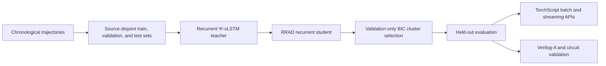
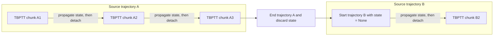
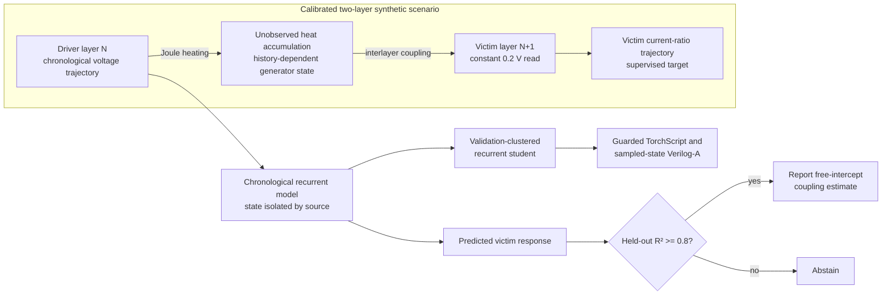
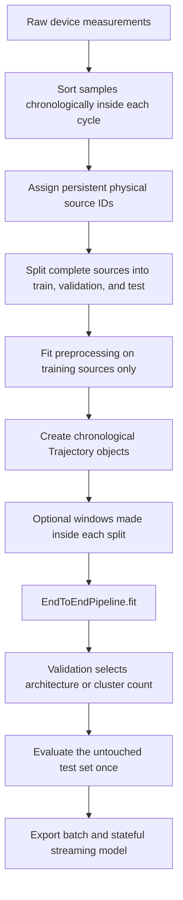

# Ψ-Vortex

## Structure-Regularized Recurrent Learning for Latent Thermal-Coupling Inference and Verilog-A Compact Modeling of 3D Neuromorphic Devices


This is the complete public reproducibility bundle for Ψ-Vortex. It contains the canonical executable implementation, immutable input data, all declared experiment configurations, automated regression tests, the verified final result record, and deployment artifacts.


```mermaid
flowchart LR
    A["Chronological trajectories"] --> B["Source-disjoint train, validation, and test sets"]
    B --> C["Recurrent Ψ-xLSTM teacher"]
    C --> D["RRAD recurrent student"]
    D --> E["Validation-only BIC cluster selection"]
    E --> F["Held-out evaluation"]
    F --> G["TorchScript batch and streaming APIs"]
    F --> H["Verilog-A and circuit validation"]
```

## Canonical recurrence contract

Every recurrent teacher, student, distillation, training, evaluation, clustering, and export path follows one contract:

- Inputs have shape `[batch, sequence_length, features]`.
- Recurrent experiments require `sequence_length > 1`.
- Timesteps remain in chronological order.
- Shuffling is permitted only across complete trajectories or complete windows.
- Train, validation, and test splits are disjoint at the persistent source-trajectory level.
- State resets between independent trajectories.
- State propagates only between contiguous truncated backpropagation through time (TBPTT) chunks from the same trajectory and is detached at each chunk boundary.
- Validation data select architecture and cluster count. Test data are used only for final reporting.
- Mean squared error (MSE) and Bayesian information criterion (BIC) calculations both count scalar target elements.
- Batched export rejects length-one sequences. Stateful `step()` advances one physical sample at a time.

The complete contract is in [RECURRENCE_CONTRACT.md](RECURRENCE_CONTRACT.md). Tests fail if sequence length silently becomes one, timesteps are internally shuffled, a recurrent path becomes pointwise, or state crosses trajectory boundaries.


```mermaid
flowchart LR
    subgraph A["Source trajectory A"]
        A1["TBPTT chunk A1"] -->|"propagate state, then detach"| A2["TBPTT chunk A2"]
        A2 -->|"propagate state, then detach"| A3["TBPTT chunk A3"]
    end
    A3 --> R["End trajectory A and discard state"]
    R --> B1["Start trajectory B with state = None"]
    subgraph B["Source trajectory B"]
        B1 -->|"propagate state, then detach"| B2["TBPTT chunk B2"]
    end
```

## The 3D thermal-coupling scenario

The motivating case study asks whether a history-dependent interlayer effect can be inferred from electrical trajectories without providing temperature measurements or coupling labels to the model. It is a calibrated two-layer synthetic proof of concept, not experimental validation on a fabricated stack.


```mermaid
flowchart LR
    subgraph S["Calibrated two-layer synthetic scenario"]
        D["Driver layer N<br/>chronological voltage trajectory"]
        H["Unobserved heat accumulation<br/>history-dependent generator state"]
        V["Victim layer N+1<br/>constant 0.2 V read"]
        O["Victim current-ratio trajectory<br/>supervised target"]
        D -->|"Joule heating"| H
        H -->|"interlayer coupling"| V
        V --> O
    end

    D --> M["Chronological recurrent model<br/>state isolated by source"]
    M --> P["Predicted victim response"]
    P --> Q{"Held-out R² >= 0.8?"}
    Q -->|"yes"| A["Report free-intercept<br/>coupling estimate"]
    Q -->|"no"| X["Abstain"]
    M --> C["Validation-clustered<br/>recurrent student"]
    C --> E["Guarded TorchScript and<br/>sampled-state Verilog-A"]
```

The reported coupling coefficient is estimated post hoc from disjoint held-out driver trajectories. It is not a literal learned parameter in the exported model. At `α = 0.08`, the recurrent configuration accepts 3/3 seeds, while the state-reset, shuffled-order, and pointwise/no-memory controls accept 0/9. The multilayer extension is not established.

## Ψ-family methodological lineage

This table summarizes the primary scope added by each framework. It is a methodological lineage, not a matched performance comparison across different publications and datasets. "Not in original scope" does not mean that a capability is impossible.

| Capability                                                   |         Ψ-NN          |         Ψ-HDL         |        Ψ-xLSTM        |     **Ψ-Vortex v1.0.0**     |
| ------------------------------------------------------------ | :-------------------: | :-------------------: | :-------------------: | :-------------------------: |
| Teacher-student structural learning                          |          Yes          |          Yes          |          Yes          |             Yes             |
| Recurrent temporal architecture                              |          No           |          No           |          Yes          |             Yes             |
| Recurrent Relation-Aware Distillation                        |          No           |          No           |          Yes          |             Yes             |
| Verilog-A generation                                         |          No           |          Yes          |          Yes          |             Yes             |
| Canonical `[batch, sequence_length, features]` contract      |    Not applicable     |    Not applicable     | Not in original scope |             Yes             |
| Source-disjoint splits, state isolation, and contiguous TBPTT |    Not applicable     |    Not applicable     | Not in original scope |             Yes             |
| Validation-selected architecture and cluster count           |          No           |          No           |          No           | Bounded candidate selection |
| Held-out R² acceptance and abstention                        |          No           |          No           |          No           |             Yes             |
| Latent thermal-coupling benchmark                            |          No           |          No           |          No           | Bounded synthetic evidence  |
| Guarded batch and stateful streaming export                  | Not in original scope | Not in original scope | Not in original scope |             Yes             |
| Compiled sampled-state recurrent OpenVAF/ngspice validation  |    Not applicable     |    Not applicable     | Not in original scope |     Five stimuli passed     |

## Verified result record

The verified final evidence is in [`results/manuscript_record/`](results/manuscript_record/).

The public record contains:

| Record item                                  | Verified value |
| -------------------------------------------- | -------------: |
| Registered experiment groups                 |          28/28 |
| Active result rows                           |            895 |
| Result rows with checked source-level splits |            643 |
| Checkpoint references                        |            468 |
| Unique checkpoint files                      |            394 |
| Public package version                       |          1.0.0 |

The complete numerical record is under `raw_results/`. Every retained file is covered by [`manifests/file_inventory.csv`](results/manuscript_record/manifests/file_inventory.csv), including its byte size and SHA-256 digest.

## Valid final results

### Recurrence and latent recovery

At the nominal coupling coefficient `α = 0.08`, chronological Ψ-Vortex gives mean recovered `α̂ = 0.08738 ± 0.00900`, mean held-out `R² = 0.981`, and 3/3 accepted seeds. State-reset, shuffled-order, and pointwise/no-memory controls accept 0/9 seeds in total. Their largest mean `R²` is 0.009.

The complete declared coupling sweep is:

| True α | Mean relative error | Mean held-out R² | Accepted seeds |
| -----: | ------------------: | ---------------: | -------------: |
|   0.05 |                4.6% |            0.980 |            3/3 |
|   0.08 |                9.2% |            0.981 |            3/3 |
|   0.10 |               36.0% |            0.698 |            1/3 |
|   0.15 |               56.5% |            0.588 |            1/3 |
|   0.20 |               58.6% |            0.569 |            0/3 |

The result record supports recovery at `α = 0.05` and `α = 0.08`. It does not support reliable full-range recovery.

Matched static controls fail throughout the five-alpha sweep. MLP, PIKAN, and SINDy each accept 0/15 runs. A matched vanilla LSTM accepts 14/15, confirming that chronological recurrence is the decisive mechanism without claiming that the Ψ-Vortex cell is uniquely necessary.

### RRAD and structural selection

Full Recurrent Relation-Aware Distillation (RRAD) has mean test MSE 0.02467. Removing the BIC, hidden-state, or temporal terms increases predictive error, but every RRAD ablation still accepts all three nominal-coupling seeds. RRAD is therefore credited with predictive fidelity, not with being necessary for recurrence.

Validation-selected BIC clustering chooses 16 effective values for the nominal recurrent student. The full BIC arm has mean test MSE 0.02467, compared with 0.06208 without BIC. Cluster selection is applied to the exported recurrent model before compression is reported.

### Initialization, symmetry, and architecture selection

Under the declared shared-target printed-sequence protocol, physics-aware initialization reaches the target after 6.8 epochs on average versus 462.0 for random initialization. The mean per-seed speedup is 116.6 times. This does not imply universally better fidelity. On thermal recovery, random initialization gives test MSE 0.02467, while physical retention gives 0.17526.

The automatic symmetry detector abstains with `none` on all five seeds. Automatic and identity initialization both give validation MSE 0.02513, compared with 0.03544 for imposed odd symmetry. This is valid fallback behavior, not recovery of odd symmetry.

The bounded 36-candidate architecture search lowers mean validation MSE from 0.02539 for the declared reference `(64, 2, 16)` to 0.01911, a 24.7% improvement. The five seeds select five different configurations, so no universal architecture is claimed.

### Measured-device fidelity and baselines

On source-disjoint measured memristor cycles, recurrent Ψ-Vortex obtains device-level seed-mean correlations from 0.997 to 1.000. The reported normalized root mean squared errors are 0.03344, 0.01125, and 0.02899 for GO-PDADMAC4, GO-PEI3, and GO-PEI4, respectively.

Cross-device and cross-rate cell-mean correlations are at least 0.974 and 0.976. Individual-seed minima are 0.963 and 0.964, so the public record does not claim that every seed exceeds 0.97. MLP and PIKAN device means remain at least 0.992, while SINDy device means range from 0.854 to 1.000.

### Compression and deployment accounting

The canonical synthetic export accounting is:

| Model                | Effective values | Expanded parameters | Expanded float32 bytes | Serialized artifact bytes |
| -------------------- | ---------------: | ------------------: | ---------------------: | ------------------------: |
| Recurrent teacher    |           26,273 |              26,273 |                105,092 |            not applicable |
| Clustered GRU export |               16 |                 273 |                  1,092 |                    14,875 |

This is a 98.96% reduction in expanded parameter count. Centroid count, expanded parameters, expanded bytes, and serialized file size are intentionally reported as different quantities. The TorchScript artifact is not centroid-coded storage.

The separate three-seed GO-PEI4 compression sweep gives teacher mean NRMSE 0.0156. The lowest student architecture mean is 0.0319 at 3,489 expanded parameters. The smallest tested student has 28 expanded parameters and mean NRMSE 0.0660.

Both guarded TorchScript exports pass batched and stateful-streaming comparisons. The largest absolute batch/streaming error is `1.39475e-05`. The exported GRU has 14,875 serialized bytes, while the low-rank export has 9,677 serialized bytes.

The sampled-state Verilog-A model compiles with OpenVAF-reloaded `20260616-2-gc592eed6`, loads through OSDI, and executes in ngspice 45.2. All five stimuli pass. The worst OSDI-versus-PyTorch absolute error is `5.46249e-05`, below the declared `1e-3` tolerance. This validates equation-level circuit execution. It is not process design kit or fabricated-device validation, and TorchScript validation is a separate claim.

### Important interpretive limits

- Two-source detection does not pass every seed at every noise level. The observed grid is reported directly.
- Missing samples are the worst tested artifact, with a 30.9 percentage-point mean degradation and 2/3 accepted seeds.
- Geometry transfer accepts 19/21 runs, with mean coefficient errors from 3.8% to 27.7%.
- The multilayer experiment is not established. The three layers accept 1/3 seeds each, with mean errors above 50%.
- Only pulse width 60 accepts all three seeds. Widths 10, 30, and 120 accept 0/3, 1/3, and 0/3.
- Long-sequence runs at 3,000, 10,000, and 50,000 generated steps pass the `R²` gate, but coefficient errors range from 13.8% to 29.5%.
- Exact scalable-BIC comparisons extend through 8,000 weights. Approximate methods execute at 50,000 weights, but exact agreement is not claimed above 8,000.

## Repository contents

```text
.
├── psi_vortex/                    canonical recurrent library
├── experiments/                   28 registered experiment groups and runner
├── tests/                         recurrence, science, and export tests
├── configs/                       smoke and final configurations
├── data/                          immutable synthetic and measured inputs
├── manifests/                     data and experiment-coverage manifests
├── results/manuscript_record/
│   ├── raw_results/               active per-run metrics
│   ├── checkpoints/               checkpoints referenced by active rows
│   ├── artifacts/                 TorchScript, Verilog-A, OSDI, and ngspice evidence
│   ├── figures/ and tables/       generated numerical artifacts
│   └── manifests/                 hashes and aggregate record counts
├── tools/                         result-record verification tools
└── .github/workflows/ci.yml        public continuous-integration checks
```

Static models are available only as clearly labeled experimental controls. Every public recurrent model uses the chronological sequence contract.

## Installation

Python 3.10 or newer is required.

```bash
python -m venv .venv
python -m pip install --upgrade pip
python -m pip install -e .
```

For CUDA reproduction, install the PyTorch build appropriate for the local CUDA driver before installing this package. The final configuration requests CUDA and intentionally refuses silent CPU substitution.

The measured Excel files are redistributed under their accompanying dataset license in [`data/measured/DATASET_LICENSE.txt`](data/measured/DATASET_LICENSE.txt).

## Validate the public bundle

These commands do not retrain the full experiment suite:

```bash
python -m psi_vortex verify
python -m unittest discover -s tests -v
python tools/verify_public_record.py
```

Expected results are 28/28 experiment groups, 895 result rows, 643 source-split rows, 468 checkpoint references, and 394 unique checkpoints. The CUDA-only test is skipped on CPU systems.

## Run a smoke reproduction

The smoke profile checks all experiment paths with reduced epochs. It is not final evidence.

```bash
psi-vortex list
psi-vortex run --config configs/smoke.json --groups all --output results/smoke-local --fail-fast
```

## Reproduce the full campaign

The final profile trains hundreds of models and is computationally expensive. Use a CUDA-capable system, a persistent output directory, and `--resume`. Completed groups and verified checkpoints are reused only when configuration, source, package, and artifact hashes match.

```bash
psi-vortex run --config configs/final.json --groups all \
  --output results/final-rerun --fail-fast --resume
```

Do not mix this output with the verified record or with outputs created by another package version. All declared seeds are retained, and no best-performing seed may be selected.

Individual groups can be listed and executed as follows:

```bash
psi-vortex list
psi-vortex run --config configs/final.json --groups recurrence_controls,latent_recovery \
  --output results/selected-rerun --fail-fast --resume
```

## OpenVAF and ngspice validation

Behavioral Verilog-A generation is always available. Compiled validation requires OpenVAF-reloaded and ngspice. On Windows, run from a Visual Studio x64 native-tools environment and either place `openvaf-r` on `PATH` or set:

```powershell
$env:PSI_VORTEX_OPENVAF = 'C:\path\to\openvaf-r.exe'
psi-vortex run --config configs/final.json --groups circuit_validation --output results/circuit-local
```

If the external tools are unavailable, the run records a skip and does not label TorchScript as circuit-simulator validation.

## Citation

Citation metadata are provided in [`CITATION.cff`](CITATION.cff).

```bibtex
@misc{jurj_psi-vortex_2026,
  author = {Sorin Liviu Jurj},
  title = {Ψ-Vortex: Structure-Regularized Recurrent Learning for Latent Thermal-Coupling Inference and Verilog-A Compact Modeling of 3D Neuromorphic Devices},
  year = {2026},
  note = {under review}
}
```

## Licenses

The source code is released under the MIT License. The measured memristor files retain their separate CC BY 4.0 dataset license. See [`LICENSE`](LICENSE) and [`data/measured/DATASET_LICENSE.txt`](data/measured/DATASET_LICENSE.txt).

## Use Ψ-Vortex with your own measured data

New datasets should enter through the public trajectory and pipeline APIs. Do not copy an experiment function and do not flatten cycles into independent points. The recommended workflow is:


```mermaid
flowchart TD
    A["Raw device measurements"] --> B["Sort samples chronologically inside each cycle"]
    B --> C["Assign persistent physical source IDs"]
    C --> D["Split complete sources into train, validation, and test"]
    D --> E["Fit preprocessing on training sources only"]
    E --> F["Create chronological Trajectory objects"]
    F --> G["Optional windows made inside each split"]
    G --> H["EndToEndPipeline.fit"]
    H --> I["Validation selects architecture or cluster count"]
    I --> J["Evaluate the untouched test set once"]
    J --> K["Export batch and stateful streaming model"]
```

### Files that define the public workflow

| File                                                         | Use                                                          |
| ------------------------------------------------------------ | ------------------------------------------------------------ |
| [`psi_vortex/data.py`](psi_vortex/data.py)                   | `Trajectory`, chronological windows, complete-trajectory batching, and contiguous TBPTT chunks |
| [`psi_vortex/datasets.py`](psi_vortex/datasets.py)           | Built-in CSV and Excel loaders plus source-level split helpers |
| [`psi_vortex/pipeline.py`](psi_vortex/pipeline.py)           | Teacher training, RRAD distillation, validation-only BIC selection, evaluation, and export |
| [`psi_vortex/models.py`](psi_vortex/models.py)               | Canonical teacher, GRU student, and low-rank recurrent student |
| [`psi_vortex/trainer.py`](psi_vortex/trainer.py)             | Lower-level trajectory-safe training and state handling      |
| [`psi_vortex/export.py`](psi_vortex/export.py)               | Guarded TorchScript batch and stateful `step()` deployment APIs |
| [`tests/test_recurrence_and_science.py`](tests/test_recurrence_and_science.py) | Executable examples of sequence, ordering, split, and state-isolation requirements |
| [`configs/smoke.json`](configs/smoke.json)                   | Small configuration example for checking a new environment, not universal hyperparameters |

Write new outputs to a separate directory such as `results/my_device_study/`. Do not modify `results/manuscript_record/` or reuse its checkpoints as results for a new dataset.

### Printed-memristor CSV format

The built-in `load_printed_memristor()` path expects at least these columns:

| Column      | Meaning                                                      |
| ----------- | ------------------------------------------------------------ |
| `device_id` | Persistent physical device or sample identifier              |
| `cycle_id`  | Complete voltage sweep or independently acquired cycle identifier |
| `voltage`   | Input voltage in chronological acquisition order             |
| `current`   | Target current in the same order                             |

Optional `voltage_noisy` and `current_noisy` columns are used when `use_noisy=True`. Rows must already be ordered by `device_id`, `cycle_id`, and physical sample order because the loader never shuffles or sorts timesteps internally. The loader creates two features: voltage and normalized position within the cycle. It scales current by the standard deviation of the selected current column over the supplied file.

For a quick compatibility run on a preordered CSV:

```python
from psi_vortex import load_printed_memristor, split_printed_memristor_sources

trajectories = load_printed_memristor("my_printed_memristors.csv")
train, validation, test = split_printed_memristor_sources(
    trajectories,
    train_devices=[0, 1, 2],
    validation_devices=[3],
    test_devices=[4],
)
```

The three device lists must be nonempty, available in the CSV, and mutually disjoint. This path matches the repository preprocessing. For new scientific comparisons, train-only normalization is preferable. The following complete adapter shows that stricter workflow and also preserves measured time.

### Recommended train-only preprocessing and training example

Prepare a CSV containing `device_id`, `cycle_id`, `sample_index`, `time`, `voltage`, and `current`. Every `(device_id, cycle_id)` pair must describe one complete chronological trajectory with at least two samples.

```python
import json
from pathlib import Path

import numpy as np
import pandas as pd
import torch

from psi_vortex import EndToEndPipeline, Trajectory, assert_source_disjoint

data_path = Path("my_printed_memristors.csv")
frame = pd.read_csv(data_path)
required = {
    "device_id", "cycle_id", "sample_index", "time", "voltage", "current"
}
missing = required - set(frame.columns)
if missing:
    raise ValueError(f"missing columns: {sorted(missing)}")

# Stable sorting is explicit. No Ψ-Vortex component sorts timesteps for you.
frame["device_id"] = frame["device_id"].astype(str)
frame = frame.sort_values(
    ["device_id", "cycle_id", "sample_index"], kind="mergesort"
)

# Replace these IDs with persistent physical devices from your experiment.
train_ids = {"device_01", "device_02", "device_03"}
validation_ids = {"device_04"}
test_ids = {"device_05"}
if train_ids & validation_ids or train_ids & test_ids or validation_ids & test_ids:
    raise ValueError("physical source IDs must be disjoint")

available = set(frame["device_id"])
requested = train_ids | validation_ids | test_ids
if requested - available:
    raise ValueError(f"unknown device IDs: {sorted(requested - available)}")

# Fit every scale on training sources only.
train_rows = frame[frame["device_id"].isin(train_ids)]
voltage_scale = float(train_rows["voltage"].abs().max())
current_scale = float(train_rows["current"].abs().max())
if not np.isfinite(voltage_scale) or voltage_scale <= 0:
    raise ValueError("training voltage scale must be finite and positive")
if not np.isfinite(current_scale) or current_scale <= 0:
    raise ValueError("training current scale must be finite and positive")

def make_trajectories(device_ids: set[str]) -> list[Trajectory]:
    selected = frame[frame["device_id"].isin(device_ids)]
    trajectories = []
    for (device_id, cycle_id), part in selected.groupby(
        ["device_id", "cycle_id"], sort=True
    ):
        part = part.sort_values("sample_index", kind="mergesort")
        time = part["time"].to_numpy(dtype=np.float32)
        if len(time) < 2 or np.any(np.diff(time) <= 0):
            raise ValueError(
                f"{device_id}/{cycle_id} needs at least two strictly ordered samples"
            )
        progress = np.linspace(0.0, 1.0, len(part), dtype=np.float32)
        features = np.column_stack(
            [part["voltage"].to_numpy(np.float32) / voltage_scale, progress]
        )
        targets = (
            part["current"].to_numpy(np.float32)[:, None] / current_scale
        )
        source_id = f"physical-device-{device_id}"
        trajectories.append(
            Trajectory(
                trajectory_id=f"{source_id}-cycle-{cycle_id}",
                features=torch.from_numpy(features),
                targets=torch.from_numpy(targets),
                time=torch.from_numpy(time[:, None]),
                source_trajectory_id=source_id,
            )
        )
    if not trajectories:
        raise ValueError("each split must contain at least one trajectory")
    return trajectories

train = make_trajectories(train_ids)
validation = make_trajectories(validation_ids)
test = make_trajectories(test_ids)
assert_source_disjoint(train, validation, test)

device = "cuda" if torch.cuda.is_available() else "cpu"
pipeline = EndToEndPipeline(
    input_size=2,
    output_size=1,
    teacher_hidden=64,
    teacher_blocks=2,
    student_hidden=16,
    student_type="gru",       # or "low_rank"
    student_rank=4,
    seed=0,
    device=device,
)
metrics = pipeline.fit(
    train,
    validation,
    test,
    teacher_epochs=100,
    student_epochs=100,
    batch_size=min(4, len(train)),
    chunk_length=64,
    teacher_lr=5e-3,
    student_lr=1e-3,
    max_grad_norm=1.0,
    cluster_candidates=(4, 8, 16),
    lambda_bic=0.01,
    bic_start_epoch=25,
)
print(metrics)
print("selected clusters:", pipeline.selected_cluster_count)

output = Path("results/my_device_study")
output.mkdir(parents=True, exist_ok=True)
artifact = pipeline.export(
    train[0].features[: min(256, len(train[0].time))].unsqueeze(0),
    output / "printed_memristor_student.pt",
)
(output / "preprocessing_and_split.json").write_text(
    json.dumps(
        {
            "voltage_scale": voltage_scale,
            "current_scale": current_scale,
            "train_ids": sorted(train_ids),
            "validation_ids": sorted(validation_ids),
            "test_ids": sorted(test_ids),
            "selected_cluster_count": pipeline.selected_cluster_count,
        },
        indent=2,
    ),
    encoding="utf-8",
)
print("exported:", artifact)
```

The epoch counts and architecture above are starting values, not universal settings. Select them with validation sources only. For a reported study, declare all seeds in advance, retain every seed, record the source IDs in each split, and evaluate the test set only after all choices are fixed.

### Batch and streaming inference

The exported model accepts complete sequences through `forward()` and individual physical samples through `step()`. Reset the state before every independent device trajectory or cycle.

```python
import json
from pathlib import Path

import torch

model = torch.jit.load(
    "results/my_device_study/printed_memristor_student.pt",
    map_location="cpu",
)
metadata = json.loads(
    Path("results/my_device_study/preprocessing_and_split.json").read_text(
        encoding="utf-8"
    )
)
trajectory = test[0]
sequence = trajectory.features.unsqueeze(0)  # [1, sequence_length, 2]

with torch.no_grad():
    normalized_batch_current = model(sequence)

    state = model.initial_state(1)
    streamed = []
    for x_t in trajectory.features:
        y_t, state = model.step(x_t.unsqueeze(0), state)
        streamed.append(y_t)
    normalized_stream_current = torch.stack(streamed, dim=1)

torch.testing.assert_close(
    normalized_stream_current,
    normalized_batch_current,
    rtol=1e-4,
    atol=2e-5,
)
current_amperes = normalized_batch_current * metadata["current_scale"]
```

For the next independent trajectory, call `initial_state()` again. Never carry the final state from one physical source into another.

### Additional features, multiple outputs, and windows

- To add temperature, pulse width, material composition, or another measured input, append it to the `features` columns, normalize it using training sources only, and set `input_size` to the resulting feature count.
- Multiple measured targets are supported. Store targets as `[sequence_length, output_size]` and set `output_size` accordingly. MSE and BIC both count scalar target elements.
- If trajectories are too long, pass full trajectories to `pipeline.fit()` and use `chunk_length` for contiguous TBPTT. This preserves state across neighboring chunks and detaches it only at chunk boundaries.
- If fixed windows are scientifically required, call `make_windows()` only after the source-level split. Never place overlapping windows from one physical source in different splits.
- If only one physical device is available, held-out-device generalization cannot be measured. Independently reset cycles may be assigned cycle-level source IDs, but the resulting claim must be limited to held-out-cycle performance.

Before trusting a new result, run the recurrence tests and add a dataset-specific test that checks chronological time, sequence length greater than one, disjoint source IDs, and state reset at every independent trajectory boundary.
